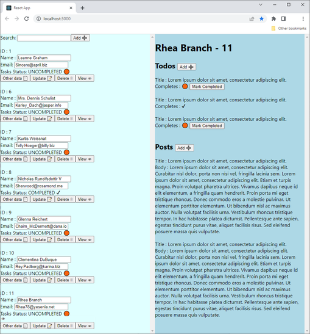

# User Manager Panel
This is a React application that demonstrates a users manager panel. The panel allows admins to manage for users their Posts and Tasks.  
  
This Project based on the (server) data provided by JSONPlaceholder:  
https://jsonplaceholder.typicode.com/users  
https://jsonplaceholder.typicode.com/posts  
https://jsonplaceholder.typicode.com/todos  
  
*The database it not real. The data is saved on the client-side, and is reset every time the user refreshes the page.  
Data managed by an object that holds in the Top Level Component and passes to children with Props.  
  
# Features
The following features are available in the user manager panel:

* User management: Admin can be added, edited, and deleted users from the system.
* Task management: Admin can create tasks for users. And make it complete when the user finishes.
* Post management: Admin can create posts for users.

# Technologies
The following technologies were used to build this application:

* React: A JavaScript library for building user interfaces.
* Axios: A library for making HTTP requests.

# Installation
To run the application locally, follow these steps:

1. Clone the repository.  
2. Install the dependencies by running `npm install` or `yarn install`.  
3. Run the application by running npm start or yarn start.  
  
For more information read the [React readme](react.md).  
  
# Usage
Once the application is running, on the left side you see a list of the users.  
You can filter the list in the searchbox.  
You can add new users by pressing the add button.  
For every user you have buttons to delete, update, See More Data and View.  
The View Button opens the user Posts and Tasks on the right side of the screen.  
From the right side of the screen you can add Tasks, Posts and make Tasks complete.  
  
# Remark
This project was developed by Aviv Vexler. Remarks are welcome!  
If you not understand something in the code, please send me email or open issue on the [GitHub repository](https://github.com/aviv1620/Simple-Users-Application).  
  
# Screenshot

